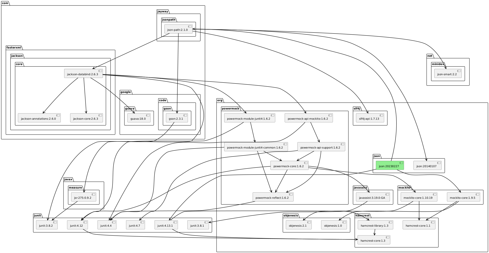
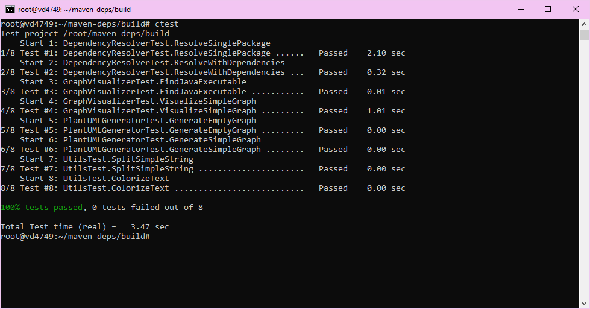

# maven-deps

## Общее описание
**maven-deps** — это утилита для анализа зависимостей Maven-пакетов. Программа извлекает зависимости указанного пакета из центрального репозитория Maven, строит граф зависимостей, генерирует визуальное представление в формате PlantUML и визуализирует его с помощью PlantUML. Утилита поддерживает настройку глубины анализа зависимостей.

## Описание всех функций и настроек
Основные компоненты программы:
1. **`DependencyResolver`** — отвечает за рекурсивное извлечение зависимостей пакетов из репозитория Maven.
2. **`PlantUMLGenerator`** — создает граф зависимости в формате PlantUML.
3. **`GraphVisualizer`** — генерирует графическое представление графа зависимостей с использованием PlantUML.
4. **`Utils`** — вспомогательные функции, включая обработку строк и цветной вывод в консоль.
- **Параметры командной строки:**
  - `--visualizer` (`-v`): Путь к JAR-файлу PlantUML.
  - `--package` (`-p`): Полное имя Maven-пакета в формате `groupId:artifactId:version`.
  - `--depth` (`-d`): Максимальная глубина анализа зависимостей (по умолчанию — 10000).
  - `--help` (`-h`): Вывод справки.

## Зависимости 

- [Java](https://www.oracle.com/java/technologies/downloads/)
- [PlantUML](https://github.com/plantuml/plantuml/releases/download/v1.2024.8/plantuml.jar)
  - graphviz

## Cборка проекта

Необходимые зависимости для разработки:
- gcc || clang || msvc
- [Conan](https://conan.io/downloads)
- [CMake](https://cmake.org/download/)

Пример профиля gcc (под linux):
```yml
[settings]
arch=x86_64
build_type=Release
compiler=gcc
compiler.cppstd=gnu17
compiler.libcxx=libstdc++11
compiler.version=13
os=Linux
```

Далее в терминале для сборки:
```bash
conan profile detect --force
mkdir build
conan install . --output-folder=build --build=missing
cd build
cmake .. --preset conan-release 
# или cmake .. --preset conan-default 
cmake --build . --config Release
```

## Примеры использования
```bash
./maven_deps -p org.json:json:20230227 -v ../for_test/plantuml.jar
```

[graph.puml](example/graph.puml)



## Результаты тестов
Запуск тестов происходит в директории build после сборки проекта командой:
```bash
ctest
```

